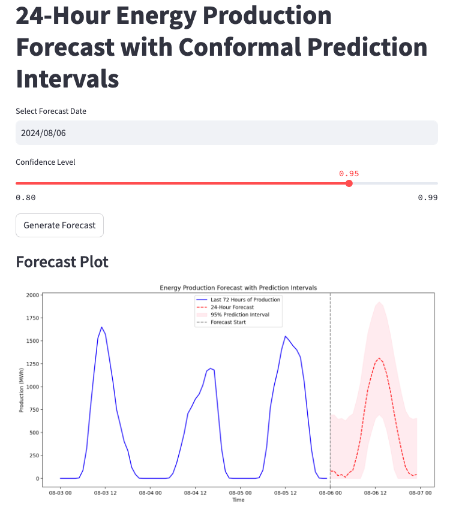

# Building an Energy Forecasting Dashboard with LSTM and Conformal Prediction Intervals
{:.no_toc}

## Table of contents
{: .no_toc .text-delta }

1. TOC
{:toc}

---


In the world of renewable energy, accurately forecasting power production is vital for balancing supply with demand. Solar energy, for example, can vary significantly based on weather and time of day, making it inherently challenging to predict. To address this, we built a predictive dashboard using **Long Short-Term Memory (LSTM)** neural networks and **conformal prediction intervals** to forecast solar energy production with quantifiable uncertainty. This interactive dashboard is developed in **Streamlit**, allowing users to generate and view forecasts along with prediction intervals.

In this post, we’ll walk through the structure of the project, discuss the methods we used, and show how we implemented it all into a Streamlit app for interactive visualization.

---

### Project Overview
The goal of this project was to:
1. **Predict the next 24 hours of solar energy production** using recent historical data.
2. **Provide a confidence interval around each prediction** to help quantify the uncertainty, enabling more informed energy management.
3. **Develop a dashboard** to visualize forecasts and interactively adjust parameters like confidence level.

Our solution integrates three main components:
- **LSTM model**: A deep learning model tailored for time series data, used here to forecast energy production.
- **Conformal prediction intervals**: A non-parametric method to calculate uncertainty bounds based on historical residuals, providing a flexible way to add uncertainty without complex assumptions.
- **Streamlit dashboard**: An easy-to-use web interface for generating and viewing forecasts.

---

### 1. Using LSTM for Time Series Forecasting

LSTM (Long Short-Term Memory) networks are a type of recurrent neural network (RNN) especially good at capturing long-term dependencies in sequential data. In this project, we trained an LSTM model on recent solar energy production data, using a sequence of the past 72 hours to predict the next 24 hours. 

Here's a breakdown of the model design:
- **Input Layer**: Receives the past 72 hours of solar production data.
- **LSTM Layers**: Capture sequential dependencies in the data, allowing the model to learn from patterns like daily production cycles.
- **Dense Output Layer**: Outputs a vector of 24 values, representing production estimates for the next 24 hours.

This model was trained offline using historical data from Energinet, a Danish energy provider, and saved as a `.keras` model file, which we load into our app.

---

### 2. Adding Uncertainty with Conformal Prediction Intervals

Predictions are useful, but they’re even more valuable with quantified uncertainty. Conformal prediction is a technique that allows us to compute valid prediction intervals, even for complex models like neural networks. It doesn’t require any distributional assumptions, making it flexible and reliable.

#### How Conformal Prediction Works
1. **Calibration Set**: We use recent historical data that wasn’t used in training as a “calibration set.”
2. **Residual Calculation**: For each point in the calibration set, we make a forecast and calculate the residual (i.e., the difference between the forecasted and actual production values).
3. **Quantile Residuals**: Based on these residuals, we calculate quantiles (for example, the 95% quantile) to define the upper and lower bounds of our prediction interval.

In practice, this means that for each forecasted value, we add an upper and lower bound based on the residual quantiles, providing a range within which future production is likely to fall, given a specified confidence level.

---

### 3. Visualizing Forecasts with Streamlit



With the forecasting model and uncertainty intervals in place, we needed an interactive way to display results. **Streamlit** was the perfect choice: it’s a Python framework designed for building data apps quickly and intuitively. Here’s how we structured our Streamlit app:

#### App Features
1. **Date Selection**: Users can select a forecast date, and the app will retrieve the necessary historical data.
2. **Confidence Level Slider**: Users can set the desired confidence level for the prediction intervals (e.g., 95%), giving control over the degree of uncertainty shown in the forecast.
3. **Forecast Generation**: When the user clicks “Generate Forecast,” the app:
   - Fetches the most recent 72 hours of data for model input,
   - Uses the LSTM model to predict the next 24 hours,
   - Computes conformal prediction intervals to show upper and lower bounds.
4. **Visualization**: The app plots the last 72 hours of historical production data, the 24-hour forecast, and shaded areas representing the prediction intervals. A dashed vertical line indicates where historical data ends and the forecast begins.

#### Code Example: Generating the Forecast in Streamlit
Here’s a simplified snippet showing the key steps in generating the forecast and displaying it in Streamlit:

```python
# Select forecast date and confidence level in Streamlit
forecast_date = st.date_input("Select Forecast Date", datetime.date.today())
confidence_level = st.slider("Confidence Level", 0.80, 0.99, 0.95)

if st.button("Generate Forecast"):
    with st.spinner("Generating forecast..."):
        # Fetch calibration data and calculate residuals
        calibration_data = get_calibration_data()
        residuals = calculate_residuals_for_conformal(model, calibration_data)

        # Generate forecast with conformal intervals
        forecast_df, historical_data = make_conformal_forecast(model, forecast_date, residuals, alpha=1-confidence_level)

        # Plotting
        fig, ax = plt.subplots(figsize=(14, 7))
        ax.plot(historical_data.index[-72:], historical_data['Production_MWh'][-72:], label='Last 72 Hours')
        ax.plot(forecast_df.index, forecast_df['Forecasted_Production_MWh'], label='Forecast', color='red', linestyle='--')
        ax.fill_between(forecast_df.index, forecast_df['Lower_Bound'], forecast_df['Upper_Bound'], color='pink', alpha=0.3, label=f'{int(confidence_level * 100)}% Prediction Interval')
        ax.axvline(x=forecast_df.index[0], color='gray', linestyle='--', label='Forecast Start')
        ax.legend()
        st.pyplot(fig)
```

---

### Results and Insights
Our app provides an intuitive interface for exploring 24-hour energy production forecasts with confidence intervals. Users can adjust the confidence level to see how the prediction interval widens or narrows, directly illustrating the trade-off between certainty and interval width. This is especially useful for energy managers who need reliable production forecasts to plan resources and maintain grid stability.

### Key Takeaways
1. **LSTM Models for Time Series**: LSTMs are effective at capturing patterns in sequential data, making them ideal for time series forecasting tasks like energy production.
2. **Conformal Prediction for Uncertainty Quantification**: Conformal prediction intervals are a practical way to add uncertainty to forecasts, providing an interpretable range around each prediction.
3. **Streamlit for Data Apps**: Streamlit’s ease of use and flexibility make it an excellent choice for quickly deploying interactive data applications.

---

### Future Directions
We plan to extend this dashboard with:
- **Additional Forecast Horizons**: Allowing users to select different forecast horizons (e.g., 6, 12, 48 hours).
- **Incorporating Weather Data**: Adding weather forecasts to the model input to improve prediction accuracy.
- **Further Model Optimization**: Experimenting with more complex architectures, such as stacked LSTMs or transformers, to enhance forecast precision.

This project demonstrates how LSTMs and conformal prediction intervals can be combined to build a powerful, interpretable forecasting tool, with Streamlit enabling straightforward deployment for end-users. Whether you’re an energy manager or a data scientist, this framework provides a reliable, scalable way to explore and visualize future energy production with uncertainty bounds.